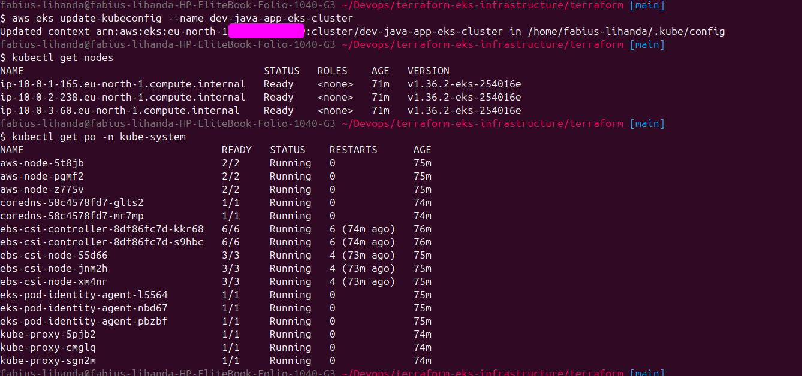
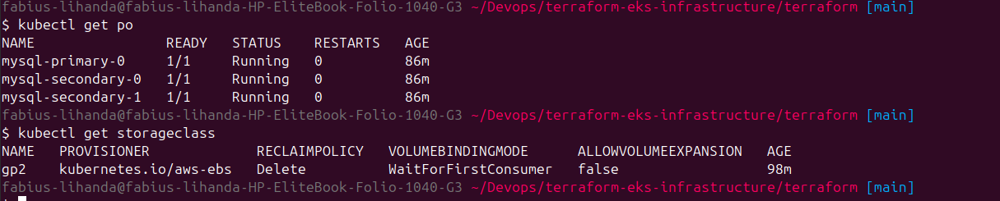
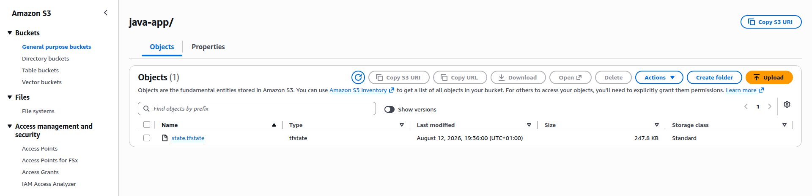
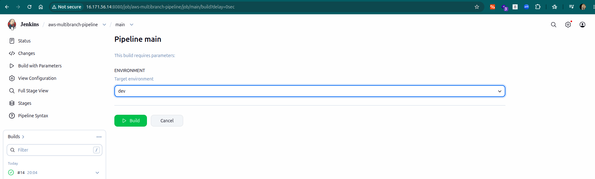
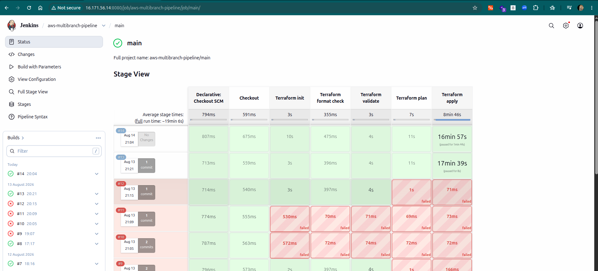

<table>
  <tr>
    <td width="70" align="center" valign="middle">
      
    </td>
    <td valign="middle">
      <h1 style="border-bottom: none; margin: 0; padding: 0; line-height: 1.2;">Terraform on AWS</h1>
      <span style="font-size: 15px; color: #57606a;">Provisioning Amazon EKS Infrastructure with Remote State &amp; CI/CD</span>
    </td>
  </tr>
</table>

---
This project demonstrates how to provision and manage a complete **Amazon Elastic Kubernetes Service (Amazon EKS)** environment using **Terraform** following Infrastructure as Code (IaC) best practices. In my [previous project](https://github.com/lihandafabius/Devops_Nana-Techworld_Bootcamp/blob/main/kubernetes-on-AWS-exercises/README.md), EKS cluster and its supporting infrastructure were provisioned using **eksctl**, while the VPC was created using an AWS **CloudFormation VPC template**. This project builds on that environment by moving the infrastructure provisioning into Terraform.

Using Terraform provides a more consistent and reusable way to manage the entire infrastructure from a single IaC tool. It allows infrastructure to be **version-controlled, modular, reviewed before deployment, and reproduced consistently** across multiple environments such as **development, testing, staging, and production**.

Instead of manually creating AWS networking resources, IAM roles, EKS clusters, node groups, and Kubernetes add-ons, the entire infrastructure is defined declaratively using Terraform modules. This approach makes the infrastructure reproducible, version-controlled, and easier to maintain as the platform evolves.

The project provisions an Amazon EKS cluster with:

* A dedicated VPC with public and private subnets
* Managed EC2 worker nodes
* An AWS Fargate profile for application workloads
* The AWS EBS CSI Driver for persistent storage
* EKS Pod Identity for secure IAM authentication
* MySQL deployed through Helm with persistent Amazon EBS volumes

In addition to infrastructure provisioning, the project implements **remote Terraform state management** using **Amazon S3** and a **Jenkins CI/CD pipeline** that automatically validates, plans, and applies infrastructure changes from a Git repository. This enables infrastructure updates to follow the same collaborative and automated workflow used for application deployments.

## Project objectives

Throughout this project, the following technologies and concepts are implemented:

* Provisioning AWS infrastructure using **Terraform**
* Creating a modular Terraform project structure
* Deploying an Amazon EKS cluster with managed node groups
* Configuring AWS Fargate profiles for Kubernetes workloads
* Deploying MySQL using Helm with persistent Amazon EBS storage
* Installing and configuring the AWS EBS CSI Driver
* Implementing **EKS Pod Identity** for secure IAM authentication
* Provisioning isolated **development, staging, and production environments** from a single Terraform codebase
* Configuring remote Terraform state in Amazon S3
* Enabling **Terraform state locking** for concurrent team collaboration
* Building a Jenkins CI/CD pipeline for infrastructure provisioning
* Validating and reviewing infrastructure changes before deployment
* Applying Infrastructure as Code best practices for reproducibility and automation


## Project structure

The Terraform project is organized into reusable modules, separating networking, Kubernetes infrastructure, and application storage components. Environment-specific configuration is managed through dedicated **Terraform variable files** (`dev.tfvars`, `staging.tfvars`, and `prod.tfvars`), allowing the same infrastructure code to be deployed across multiple environments while maintaining separate configurations and remote state files.

```text
.
├── jenkinsfile
├── LICENSE
├── README.md
└── terraform
    ├── main.tf
    ├── providers.tf
    ├── variables.tf
    ├── outputs.tf
    ├── dev.tfvars
    ├── staging.tfvars
    ├── prod.tfvars
    └── modules
        ├── vpc
        │   ├── main.tf
        │   ├── output.tf
        │   └── variables.tf
        ├── eks
        │   ├── main.tf
        │   ├── outputs.tf
        │   └── variables.tf
        └── mysql
            ├── main.tf
            ├── providers.tf
            ├── outputs.tf
            └── values.yaml
```

The root Terraform configuration orchestrates the entire infrastructure by invoking the **VPC**, **EKS**, and **MySQL** modules. Each module is responsible for a specific part of the infrastructure, allowing networking, Kubernetes resources, and database configuration to be managed independently. The environment-specific variable files provide a simple way to customize deployments for **development**, **staging**, and **production** while keeping the Terraform codebase consistent and reusable.

---
<details>
<summary>Exercise 1: Create Amazon EKS Cluster</summary>

<br />

The Terraform configuration was hosted in a **separate Git repository** from the Java application. This follows Infrastructure as Code and GitOps practices by keeping infrastructure changes independent from application changes. It allows the infrastructure team to version, review, and manage the AWS environment separately while also making it possible to reuse the same Terraform configuration for development, testing, staging, and production environments.

### Terraform modules

The infrastructure was divided into reusable **Terraform modules** rather than placing all resources in a single Terraform configuration. The project was organized into three main modules: **VPC**, **EKS**, and **MySQL**, making the infrastructure easier to maintain, reuse, and manage independently.

### VPC module

The **VPC module** provides the networking foundation for the Amazon EKS cluster. It creates a VPC with **public and private subnets** distributed across multiple Availability Zones. Public subnets are used for internet-facing resources such as load balancers and the NAT Gateway, while private subnets host the EKS worker nodes and Fargate workloads.

The module was implemented using the official **terraform-aws-modules/vpc/aws** module and configured with a **single NAT Gateway**, DNS hostnames, and subnet tagging required for Amazon EKS.

```hcl
module "vpc" {
  source  = "terraform-aws-modules/vpc/aws"
  version = "6.6.1"

  name             = "${var.application_name}_vpc"
  cidr             = var.vpc_cidr_block
  private_subnets  = var.private_subnet_cidr_blocks
  public_subnets   = var.public_subnet_cidr_blocks
  azs              = data.aws_availability_zones.azs.names

  enable_nat_gateway   = true
  single_nat_gateway   = true
  enable_dns_hostnames = true

  tags = {
    "kubernetes.io/cluster/${var.environment}-${var.application_name}-eks-cluster" = "shared"
  }

  public_subnet_tags = {
    "kubernetes.io/cluster/${var.environment}-${var.application_name}-eks-cluster" = "shared"
    "kubernetes.io/role/elb" = 1
  }

  private_subnet_tags = {
    "kubernetes.io/cluster/${var.environment}-${var.application_name}-eks-cluster" = "shared"
    "kubernetes.io/role/internal-elb" = 1
  }
}
```

> **Note:** The subnet tags allow Amazon EKS to automatically identify which subnets should be used for **public load balancers** and **internal load balancers**, enabling Kubernetes services of type `LoadBalancer` to integrate correctly with AWS networking.


### Amazon EKS module

The **EKS module** provisions the Kubernetes control plane, managed worker nodes, AWS Fargate profile, and the Kubernetes add-ons required by the environment. The cluster was created using the official **terraform-aws-modules/eks/aws** module and deployed into the private subnets created by the VPC module.

```hcl
module "eks" {
  source  = "terraform-aws-modules/eks/aws"
  version = "21.24.1"

  name               = "${var.environment}-${var.application_name}-eks-cluster"
  kubernetes_version = "1.36"

  subnet_ids = var.private_subnet_ids
  vpc_id     = var.vpc_id

  endpoint_public_access = true

  enable_cluster_creator_admin_permissions = true
}
```

The cluster name is generated from Terraform variables, allowing the same configuration to create multiple environments without modifying the module. The cluster runs **Kubernetes 1.36**, exposes a public API endpoint, and enables administrator access for the identity that provisions the cluster.

### Managed node group

The cluster was configured with an **EKS Managed Node Group** running EC2 worker nodes for stateful workloads such as MySQL.

```hcl
eks_managed_node_groups = {
  default = {
    ami_type       = var.ami_type
    instance_types = var.instance_types

    min_size     = 1
    max_size     = 3
    desired_size = 3
  }
}
```

The node group maintains **three worker nodes** by default and can scale between **one and three nodes**. The AMI type and EC2 instance type are parameterized through Terraform variables, making the configuration reusable across different environments.

### AWS Fargate profile

A dedicated **AWS Fargate profile** was created for the `java-app` namespace so that application workloads can run without managing EC2 instances.

```hcl
fargate_profiles = {
  fargate_profile = {
    selectors = [
      {
        namespace = "java-app"
      }
    ]
  }
}
```

Any workload deployed into the `java-app` namespace is automatically scheduled onto **AWS Fargate**, while stateful workloads such as MySQL continue to run on the managed EC2 nodes where Amazon EBS storage is available.

> **Note:** Fargate is well suited for stateless application workloads, while stateful applications such as MySQL are better suited for EC2 worker nodes that can attach persistent EBS volumes.

### EKS add-ons

The cluster was configured with the Kubernetes and AWS add-ons required for networking, DNS, authentication, and persistent storage.

```hcl
addons = {
  coredns = {}

  eks-pod-identity-agent = {
    before_compute = true
  }

  kube-proxy = {}

  vpc-cni = {
    before_compute = true
  }

  aws-ebs-csi-driver = {
    before_compute = true

    pod_identity_association = [
      {
        role_arn        = var.ebs_csi_role_arn
        service_account = "ebs-csi-controller-sa"
      }
    ]
  }
}
```

The configuration installs **CoreDNS**, **kube-proxy**, **Amazon VPC CNI**, the **EKS Pod Identity Agent**, and the **AWS EBS CSI Driver**. The EBS CSI Driver enables Kubernetes to dynamically provision **Amazon EBS volumes**, which are required for MySQL persistent storage.

### EKS Pod Identity

To allow the EBS CSI Driver to interact with AWS securely, the project uses **EKS Pod Identity** instead of storing AWS credentials inside Kubernetes.

```hcl
module "ebs_csi_pod_identity" {
  source  = "terraform-aws-modules/eks-pod-identity/aws"
  version = "~> 2.5"

  name = "${var.environment}-ebs-csi"

  attach_aws_ebs_csi_policy = true
}
```

The IAM role created by this module is associated with the `ebs-csi-controller-sa` service account, allowing the EBS CSI controller to create, attach, detach, and manage Amazon EBS volumes without exposing long-lived AWS access keys inside the cluster.




#### MySQL module

The **MySQL module** was used to deploy a highly available MySQL database into the Amazon EKS cluster using the **Helm provider**. The database configuration was separated into its own module so that the Helm release and MySQL configuration could be managed independently from the cluster infrastructure.

The module receives the Kubernetes and Helm providers from the root module and is configured to run only after the EKS cluster has been created.

```hcl
module "mysql" {
  source = "./modules/mysql"

  providers = {
    kubernetes = kubernetes
    helm       = helm
  }

  depends_on = [module.eks]
}
```

The `depends_on` configuration ensures that Terraform creates and makes the EKS cluster available before attempting to connect to it through the Helm provider.

### Helm deployment

The MySQL database was installed using the **Bitnami MySQL Helm chart**, allowing Terraform to manage the entire deployment lifecycle.

```hcl
resource "helm_release" "mysql" {
  name       = "mysql"
  repository = "oci://registry-1.docker.io/bitnamicharts"
  chart      = "mysql"

  values = [
    file("${path.module}/values.yaml")
  ]

  timeout = 600
}
```

The Helm values were stored separately in a `values.yaml` file, making it easier to manage replication, storage, and authentication settings without modifying the Terraform resource.

### MySQL configuration

The database was deployed in **replication mode** with one primary instance and **two secondary replicas**. Persistent Amazon EBS volumes were configured for both the primary and replica instances using the `gp2` storage class.

```yaml
architecture: replication

primary:
  persistence:
    storageClass: gp2

secondary:
  replicaCount: 2
  persistence:
    storageClass: gp2

auth:
  username: 
  password: 
  rootPassword: 

  replicationUser: replicator
  replicationPassword: 

global:
  security:
    allowInsecureImages: true

image:
  registry: docker.io
  repository: bitnamilegacy/mysql
  tag: latest
```

The deployment provides a **primary MySQL instance and two replicas**, with each instance backed by its own persistent Amazon EBS volume.



</details>

---
<details>
<summary>Exercise 2: Configure remote state</summary>

<br />

Terraform state was configured to use **Amazon S3 as a remote backend** instead of storing the state file locally. A local state file exists only on one machine, making collaboration difficult and increasing the risk of state conflicts. Using a shared remote backend provides a single source of truth for the infrastructure and allows both developers and CI/CD pipelines to work with the same Terraform state.

An **Amazon S3 bucket** was created specifically for Terraform state storage, with **versioning enabled** to maintain a history of state changes and allow previous versions of the state file to be recovered if necessary. Remember to disable public access on the S3 bucket.

```hcl
terraform {
  required_version = ">= 1.0.0"

  backend "s3" {
    bucket       = "<bucket name>"
    region       = "eu-north-1"
    use_lockfile = true
  }
}
```

The backend configuration defines the S3 bucket and AWS region used for Terraform state storage. The backend **key is intentionally not hardcoded** because it is supplied dynamically by the Jenkins pipeline during `terraform init`.

> **Note:** The backend key is selected dynamically by the Jenkins pipeline based on the target environment. During the initialization stage, the pipeline passes the backend key to Terraform using:
>
> ```groovy
> terraform init -reconfigure \
> -backend-config="key=${params.ENVIRONMENT}_java-app/state.tfstate"
> ```
>
> This creates a separate state file for each environment, such as **dev**, **staging**, and **production**, while using the same Terraform codebase. The pipeline also selects the corresponding `*.tfvars` file for the target environment, allowing each environment to maintain its own configuration and infrastructure state independently.

### State locking

The backend was configured with `use_lockfile = true`, which enables **Terraform state locking**.

State locking prevents multiple users or CI/CD pipelines from modifying the same state file simultaneously. When a Terraform operation is running, a lock is created, and any other operation must wait until the lock is released.

This protects the state file from concurrent modifications and ensures that infrastructure changes are applied consistently and safely across the team.




</details>

---

<details>
<summary>Exercise 3: CI/CD Pipeline for Terraform Provisioning</summary>

<br />

To automate infrastructure deployments, a dedicated **Jenkins pipeline** was created for the Terraform project. This allows infrastructure changes to follow the same workflow as application deployments, where changes are committed to Git, validated, reviewed, and deployed through a controlled CI/CD process.

The pipeline performs **Terraform initialization, formatting validation, configuration validation, plan generation, and deployment**, ensuring that infrastructure changes are verified before they are applied.

### Terraform Jenkins pipeline

```groovy
#!/usr/bin/env groovy

pipeline {
    agent any

    parameters {
        choice(name: 'ENVIRONMENT', choices: ['dev', 'staging', 'prod'], description: 'Target environment')
    }

    environment {
        AWS_DEFAULT_REGION = 'eu-north-1'
        TF_IN_AUTOMATION   = 'true'
    }

    stages {

        stage('Checkout') {
            steps {
                checkout scm
            }
        }

        stage('Terraform init') {
            environment {
                AWS_ACCESS_KEY_ID     = credentials('jenkins_aws_access_key_id')
                AWS_SECRET_ACCESS_KEY = credentials('jenkins_aws_secret_access_key')
            }
            steps {
                dir('terraform') {
                    sh """
                        terraform init -reconfigure \
                        -backend-config="key=${params.ENVIRONMENT}_java-app/state.tfstate"
                    """
                }
            }
        }

        stage('Terraform format check') {
            steps {
                dir('terraform') {
                    sh 'terraform fmt -check'
                }
            }
        }

        stage('Terraform validate') {
            environment {
                AWS_ACCESS_KEY_ID     = credentials('jenkins_aws_access_key_id')
                AWS_SECRET_ACCESS_KEY = credentials('jenkins_aws_secret_access_key')
            }
            steps {
                dir('terraform') {
                    sh 'terraform validate'
                }
            }
        }

        stage('Terraform plan') {
            environment {
                AWS_ACCESS_KEY_ID     = credentials('jenkins_aws_access_key_id')
                AWS_SECRET_ACCESS_KEY = credentials('jenkins_aws_secret_access_key')
            }
            steps {
                dir('terraform') {
                    sh "terraform plan -var-file=${params.ENVIRONMENT}.tfvars -out=tfplan"
                    sh 'terraform show tfplan'
                }
            }
        }

        stage('Terraform apply') {
            environment {
                AWS_ACCESS_KEY_ID     = credentials('jenkins_aws_access_key_id')
                AWS_SECRET_ACCESS_KEY = credentials('jenkins_aws_secret_access_key')
            }
            steps {
                timeout(time: 1, unit: 'HOURS') {
                    input message: "Apply Terraform changes to ${params.ENVIRONMENT}?"
                }

                dir('terraform') {
                    sh 'terraform apply -auto-approve tfplan'
                }
            }
        }
    }
}
```

### Environment selection

The pipeline was parameterized using a **Jenkins choice parameter**, allowing the target environment to be selected when the pipeline is executed.

```groovy
parameters {
    choice(name: 'ENVIRONMENT', choices: ['dev', 'staging', 'prod'], description: 'Target environment')
}
```

This allows the same pipeline to provision **development**, **staging**, and **production** environments without duplicating pipeline definitions. The selected environment is used to determine both the Terraform backend state file and the corresponding `*.tfvars` configuration file.




### Terraform initialization

Terraform is initialized using:

```bash
terraform init -reconfigure \
-backend-config="key=${params.ENVIRONMENT}_java-app/state.tfstate"
```

The `-reconfigure` flag forces Terraform to use the backend configuration provided by the pipeline without attempting to migrate state from a previous backend configuration. This is important because the backend key changes depending on the selected environment.

Using a dynamic backend key ensures that each environment maintains its **own isolated Terraform state file**, preventing changes in one environment from affecting another.

### Terraform automation mode

The pipeline enables Terraform automation mode using:

```groovy
TF_IN_AUTOMATION = 'true'
```

This configures Terraform for non-interactive execution in CI/CD environments, producing cleaner logs, suppressing interactive prompts, and generating more consistent output during automated deployments.

### Format and validation

Before any infrastructure changes are planned or applied, the pipeline runs:

```bash
terraform fmt -check
terraform validate
```

These stages ensure that the Terraform configuration follows standard formatting conventions and that the configuration is syntactically valid before deployment begins.

### Plan generation

Terraform generates an execution plan using the environment-specific variable file.

```bash
terraform plan -var-file=${params.ENVIRONMENT}.tfvars -out=tfplan
terraform show tfplan
```

The generated plan is displayed in the Jenkins build logs and saved to a file so that the exact plan reviewed is the same plan that is later applied.

### Manual approval with timeout

Before applying any infrastructure changes, the pipeline requires manual approval.

```groovy
timeout(time: 1, unit: 'HOURS') {
    input message: "Apply Terraform changes to ${params.ENVIRONMENT}?"
}
```

The `timeout` block prevents the pipeline from waiting indefinitely for user input, which could otherwise block Jenkins resources if the approval is never provided.

This provides a controlled deployment process while ensuring that infrastructure changes cannot remain in a pending state indefinitely.

### Terraform apply

After approval is granted, the saved execution plan is applied.

```bash
terraform apply -auto-approve tfplan
```

Applying the saved plan ensures that Terraform deploys the **exact infrastructure changes that were reviewed during the planning stage**, providing a more predictable and controlled deployment process.



</details>

---
